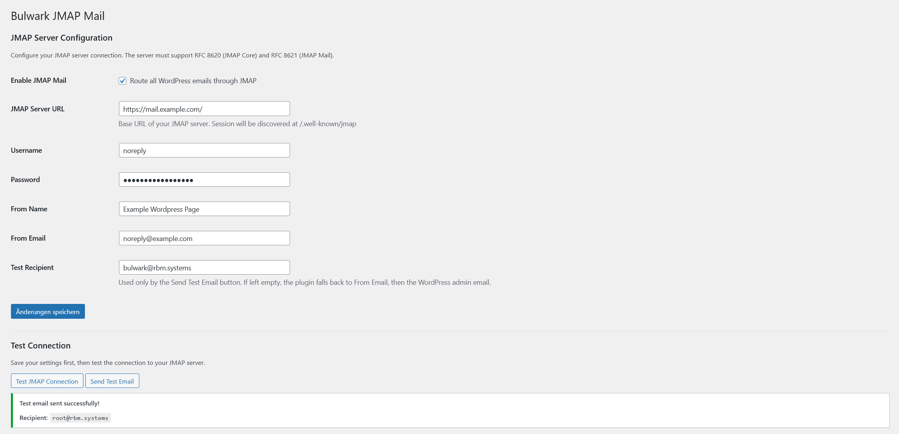
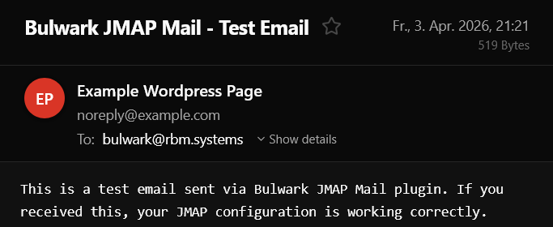

# Bulwark JMAP Mail

A WordPress plugin that routes `wp_mail()` through the modern [JMAP protocol](https://jmap.io/) (`RFC 8620` / `RFC 8621`) instead of relying on PHP mail or a traditional SMTP plugin.

## Screenshots

### Settings page

### Test email received

## Features

- Sends WordPress mail through any compatible JMAP server
- Discovers the JMAP session automatically via `.well-known/jmap`
- Handles redirected discovery endpoints and normalizes advertised API URLs for reverse-proxy setups
- Resolves the sender identity and Sent mailbox automatically
- Supports HTML and plain-text messages with plain-text fallback
- Supports CC, BCC, Reply-To, and file attachments
- Provides a dedicated **Test Recipient** field for admin test emails
- Shows account, identity, capabilities, and warnings in the connection test UI
- Includes a built-in mail log for recent sent and failed attempts
- Compatible with RFC 8620/8621 servers such as [Stalwart Mail Server](https://stalw.art/)

## Requirements

- WordPress 5.8 or later
- PHP 7.4 or later
- A JMAP server that supports `urn:ietf:params:jmap:core`, `urn:ietf:params:jmap:mail`, and `urn:ietf:params:jmap:submission`
- An account with at least one usable sending identity
- Access to a mailbox with the `sent` role

## Installation

1. Download the plugin folder or a release zip.
2. Upload the zip through **Plugins → Add New → Upload Plugin**, or copy the `bulwark-jmap-mail` folder to `/wp-content/plugins/`.
3. Activate the plugin.
4. Open **Settings → JMAP Mail**.

## Configuration

1. Enter your JMAP server URL, username, and password.
2. Set **From Name** and **From Email**.
3. Optionally set **Test Recipient** for the **Send Test Email** button.
4. Enable the plugin and save.
5. Run **Test JMAP Connection**.
6. Run **Send Test Email**.

## How it works

1. Hooks into the WordPress `pre_wp_mail` filter to intercept outgoing mail.
2. Discovers the JMAP session from `{server}/.well-known/jmap`.
3. Normalizes the advertised JMAP API and upload URLs to the configured public origin when needed.
4. Resolves the mail account, sender identity, and Sent mailbox.
5. Creates the message via `Email/set`.
6. Submits the created message via `EmailSubmission/set` using the returned email id.
7. Records the result in the admin mail log.

## Admin tools

- **Test JMAP Connection** validates session discovery and shows the resolved account, identity, capabilities, and warnings.
- **Send Test Email** sends to **Test Recipient**, then falls back to **From Email**, then the WordPress admin email.
- **Mail Log** stores the most recent 100 send attempts with timestamps, recipients, subjects, status, and error details.
- **Clear Mail Log** removes all stored log entries from the plugin settings page.

## Mail log

The mail log stores metadata only. It does not store message bodies or attachment contents.

Each entry can include:

- Timestamp
- Status (`sent` or `failed`)
- Recipient
- From address
- Subject
- Attachment count
- Account id
- Identity id
- Created email id
- Failure message, if any

## FAQ

**What is JMAP?**
JMAP (JSON Meta Application Protocol) is a modern open standard for email access and submission defined in RFC 8620 and RFC 8621. It replaces IMAP and SMTP with a JSON-over-HTTP protocol.

**Does this replace SMTP plugins?**
Yes. Instead of configuring SMTP credentials, you configure your JMAP server and WordPress mail is submitted through JMAP.

**Where does the test email go?**
The **Send Test Email** button sends to **Test Recipient** if it is set. If that field is empty, it falls back to **From Email**, then the WordPress admin email.

**Why can the connection test succeed while sending still fails?**
Connection testing only proves that session discovery and basic account access work. Actual sending can still fail if the selected account has no valid sending identity, no accessible Sent mailbox, or if the server rejects submission details.

**Is my password stored securely?**
The password is stored in the WordPress options table. For higher-security deployments, consider moving credentials into `wp-config.php` constants or another secret-management layer.

## Packaging

- Generated release archives can be stored in the `releases/` directory.
- The repository includes a `.gitignore` rule so generated zip files in `releases/` are not committed accidentally.

## Changelog

### 1.0.0

- Initial release of the WordPress JMAP mailer
- JMAP session discovery and authentication
- Compatibility fixes for redirected discovery endpoints and strict JMAP servers
- Email creation via `Email/set` followed by submission via `EmailSubmission/set`
- HTML/plain-text messages, CC/BCC/Reply-To, and attachment support
- Admin connection diagnostics, identity display, and dedicated test recipient
- Built-in mail log for sent and failed messages

## License

[AGPL-3.0-or-later](https://www.gnu.org/licenses/agpl-3.0.html)
